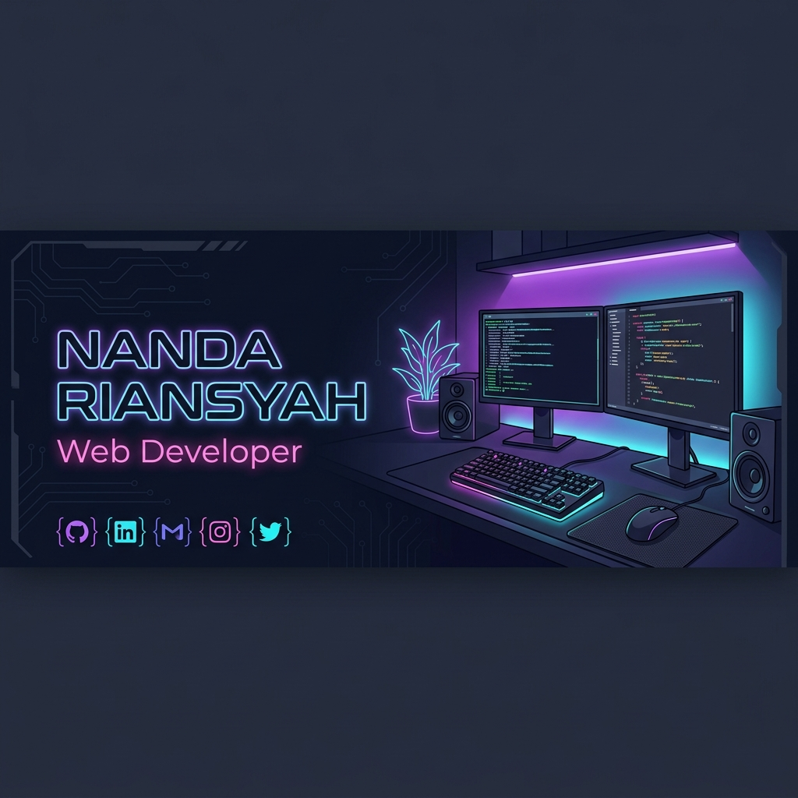
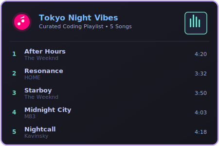

<h1 align="center">Hi 👋, I'm Nanda Riansyah</h1>
<h3 align="center">Web Developer | Tech Enthusiast | Gaming Setup Lover</h3>

  

  

  

---

### 🚀 About Me
- 🔭 **Role:** Web Developer
- 💻 **Theme:** Gaming setup → RGB style - tokyonight
- 🌱 **Learning:** Upgrading skill sets in frontend and backend technologies
- ⚡ **Fun Fact:** Loves coding at night under neon/RGB lights

---

### 🛠️ Tech Stack & Skills

  <!-- Frontend -->
  
  
  
  
  

  <!-- Backend & Tools -->
  
  
  
  
  

---

### 📊 Coding Stats & Activity

  
  

  

### 🎵 My Coding Playlist
<!-- 
  To customize your playlist card:
  1. Open the file 'assets/playlist.svg' in your editor.
  2. Change the song titles, artists, and durations to match your favorites.
  3. Replace the Spotify URL in the href below with the link to your own Spotify playlist!
-->

  

---

### 🐍 Contribution Snake

  

---

### 🌐 Connect with Me (NANTI DI ISI)
<!-- 
  To add your social links, replace the '#' inside the href with your actual profile URLs
-->

  
  
  

---

